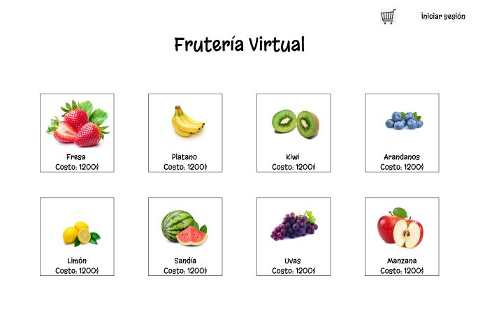
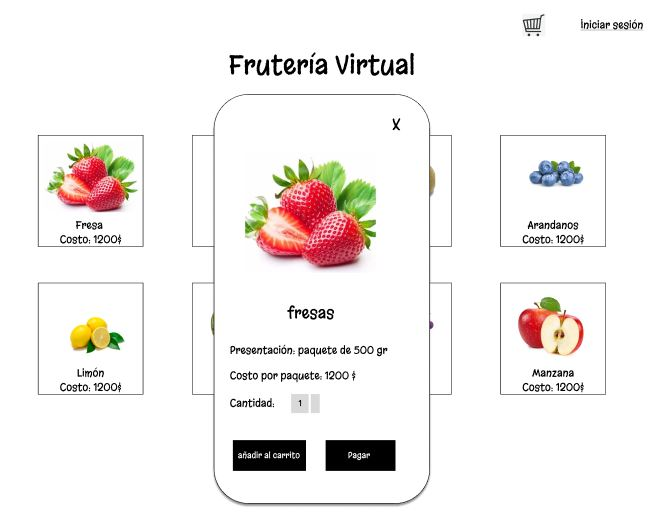
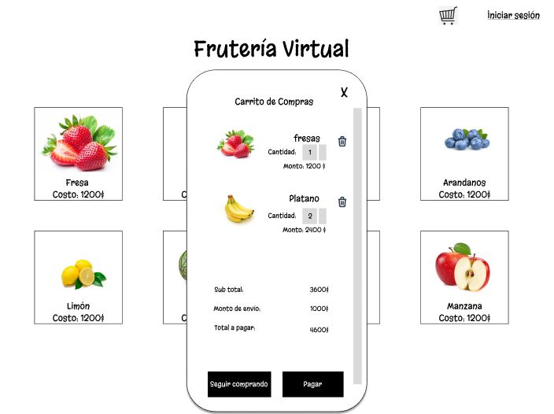
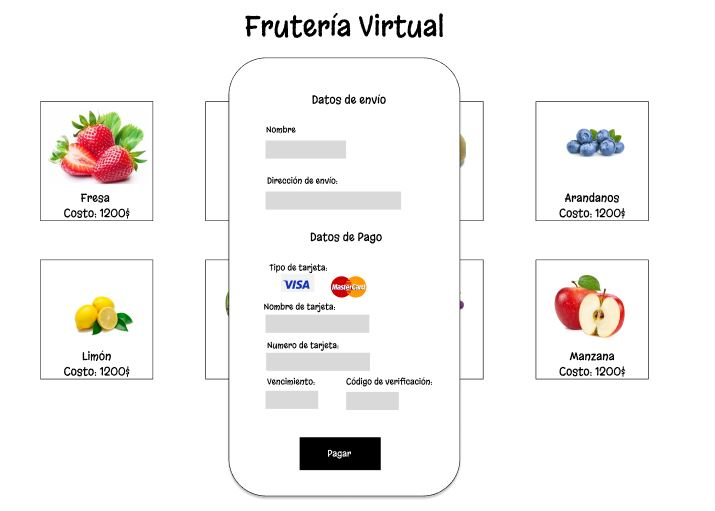
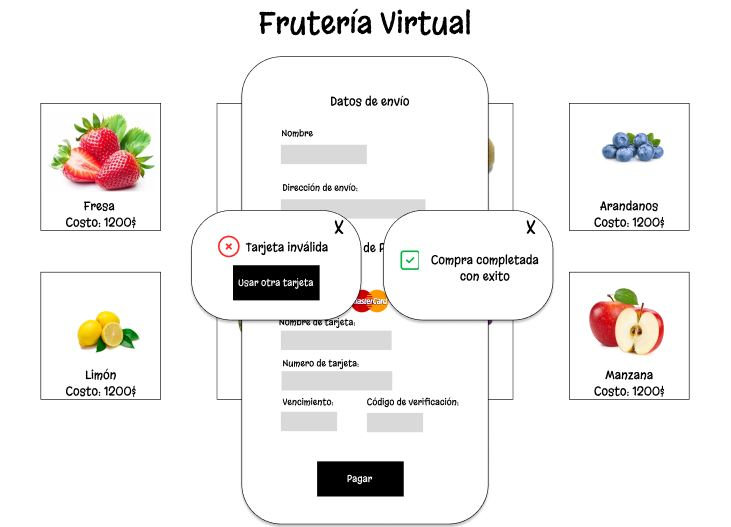

# Tarjeta de crédito válida (Fruteria-Virtual)

## Índice

* [1. Que es la Frutería-Virtual?](#1-Frutería-Virtual)
* [2. Como esta estrucrurada la web?](#2-Como-esta-estructurada-la-web?)
* [3. Como se realiza la validación de los números de la tarjeta de crédito?](#3-Como-se-realiza-la-validación-de-los-números-de-la-tarjeta-de-crédito?)
* [4. Consideraciones técnicas tomadas en cuenta](#4-consideraciones-técnicas-tomadas-en-cuenta).
* [5. Resultados](#5-Resultados)


***

## 1. Que es la Frutería-Virtual?

La “Frutería-Virtual” es un proyecto que se concibe para realizar la validación de una tarjeta de crédito
mediante la simulación de la compra de frutas en una plataforma web de muy fácil acceso, donde el usuario puede 
“seleccionar y pagar” sus productos para que sean entregados en la puerta de sus casas, evitando que el cliente 
abandone la comodidad de su hogar al trasladarse hasta las fruterías físicas.

## 2. Como esta estrucrurada la web?

La página web está estructurada de la siguiente manera:  

Primeramente, presenta una interfaz en la que se muestra al cliente los productos



El detalle del producto se puede apreciar con un click sobre la fruta que se desea escoger y por medio de la aparicion de una ventana modal, se puede observar el costo, la presentación y la cantidad del producto requerido.



Posteriormente, se van agregando productos al “carrito de compras” y se muestra el detalle de los productos a cancelar 



Luego, al accionar el pago en el botón de pagar, aparece una ventana de pago, en la que se presenta la funcionalidad de la validación de la tarjeta.




Por último y se activa, por medio de un evento click, la validación de los números ingresados en el input correspondiente y el resultado se entrega por medio de una ventana modal en la que aparece el número de la tarjeta enmascarado. 



## 3. Como se realiza la validación de los números de la tarjeta de crédito?

La validación de una tarjeta bancaria se realiza mediante el algoritmo de módulo 10 o mejor conocido como algoritmo de Luhn. Este se caracteriza por responder a los siguientes pasos: 


* 1.- El número de la tarjeta se revierte y se toma cada número como el valor correspondiente a una posición.
* 2.- el valor de las posiciones pares es multiplicado por 2.
* 3.- En caso de resultar un valor de 2 dígitos, los dígitos deben sumarse entre sí para obtener un valor de un dígito.
* 4.- En caso de resultar un valor de un solo dígito queda tal cual el valor obtenido.
* 5.- Para el caso de las posiciones impares, el valor queda tal cual el valor original.
* 6.- Una vez obtenidos los valores de cada posición (pares e impares), estos deben sumarse
* 7.- Para que el algoritmo resulte válido, el resultado de la suma debe ser múltiplo de 10, de lo contrario resultará inválido.

A continuación, se ejemplifica en la siguiente imagen: 


## 4. Consideraciones técnicas tomadas en cuenta

La lógica del proyecto está implementada completamente en JavaScript, empleando para ello una carpeta identificada como validator.js y el desarrollo de la interacción de la funcionalidad con el usuario se implementó en la carpeta index.js. Se utilizó como herramienta de trabajo e editor de texto VSC.

La estructura del proyecto es la siguiente:

```text
./
├── .babelrc
├── .editorconfig
├── .eslintrc
├── .gitignore
├── README.md
├── package.json
├── src
│   ├── validator.js
│   ├── index.html
│   ├── index.js
│   ├── style.css
│   └── Imagenes
│
└── test
    ├── .eslintrc
    └── validator.spec.js
```
## 5. Resultados

La interfaz permite al usuario insertar un numero (texto) a validar usando solo caracteres numéricos (dígitos) en la tarjeta a validar [0-9]. Asimismo, arrojar en pantalla si la tarjeta es válida o inválida junto con sus caracteres ocultos (a excepción de sus últimos 4) y si el campo se encuentra vacío, informa al usuario que debe ingresar los números de la tarjeta.

Por último, se menciona que los tests unitarios corridos arrojaron 100% de cumplimiento en: _statements_, _functions_, _lines_ y  _branches_.

